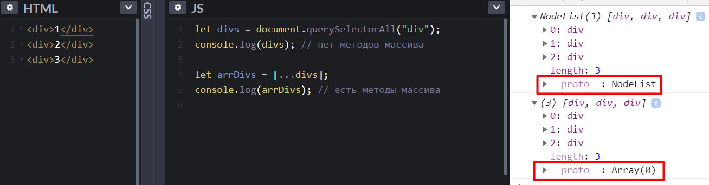

# Spread, Rest, Деструктуризация

**СОДЕРЖАНИЕ:**
- [Spread-оператор](#1)
- [Rest-оператор](#2)
- [Rest и Деструктуризация](#3)

<a id="1"></a> 

## Spread-оператор

Spread - это «оператор расширения», он извлекает элементы из массива или объекта.

**МАССИВЫ:**
```js
// spread - создание нового массива на основе существующего
let arr1 = [1, 2, [10, 20]];
let arr2 = [10, 20];
let arr3 = [ ...arr1, 'hello', ...arr2 ];

console.log(arr3); // [ 1, 2, [ 10, 20 ], 'hello', 10, 20 ]

// ВНИМАНИЕ - spread выполняет неглубокое копирование массивов
arr1[0] = 9;
arr1[2][0] = 'new';

console.log(arr1); // [ 9, 2, [ 'new', 20 ] ]
console.log(arr3); // [ 1, 2, [ 'new', 20 ], 'hello', 10, 20 ]
```

**ОБЪЕКТЫ:**
```js
// spread - создание нового объекта на основе существующего
let obj1 = { a: 1, b: { c: 2 } }
let obj2 = { d: 3 }
let obj3 = { ...obj1, key: 'new', ...obj2 }

console.log(obj3); // { a: 1, b: { c: 2 }, key: 'new', d: 3 }

obj1.a = 9;
obj1.b.c = 100;

// ВНИМАНИЕ - spread выполняет неглубокое копирование объектов
console.log(obj1); // { a: 9, b: { c: 100 } }
console.log(obj3); // { a: 1, b: { c: 100 }, key: 'new', d: 3 }
```

Если объекты имеют одинаковые ключи - spread выполняет их мерж:    
```js
let obj1 = { a: 1, x: 2 };
let obj2 = { c: 3, x: 4 };
let obj3 = { ...obj1, ...obj2 };

console.log(obj3); // { a: 1, x: 4, c: 3 };
```

**ФУНКЦИИ:**
```js
// spread можно использовать при вызове функции, для передачи массива параметров как списка:
let numbers = [2, 3, 15];

// spread при вызове ф-ции передаст массив как список аргументов:
let max = Math.max(...numbers);	// вызов аналогичен Math.max(2, 3, 15)

console.log( max ); 	// 15
```

**ПРИМЕР использования spread:**

Например, нам необходимо получить коллекцию html-элементов в виде массива. 
Для этого воспользуемся querySelectorAll и увидим, что прототипом нашей коллекции является NodeList у которого нет необходимых нам методов массивов. Чтобы исправить ситуацию - воспользуемся spread оператором:



<a id="2"></a> 

## Rest-оператор

Rest - это «остаточные параметры», он собирает неуказанные аргументы и делает из них массив.

Чтобы получить массив аргументов ф-ции, нужно использовать оператор rest, который ставится в конце параметров функции:
```js
function showName(firstName, lastName, ...rest) {
	console.log(firstName + ' ' + lastName + ' - ' + rest); // Юлий Цезарь - Император,Рима
	console.log(rest); // ["Император", "Рима"]
}
showName("Юлий", "Цезарь", "Император", "Рима"); 
```
В rest попадёт массив всех аргументов, начиная с третьего.    
Заметим, что rest – настоящий массив, с методами map, forEach и т.д.

<a id="3"></a> 

## Rest и Деструктуризация

Также rest можно использовать при **деструктуризации** – это синтаксис присваивания, при котором значения массива или объекта можно присвоить сразу нескольким переменным.

Если нужно получить все значения массива, но не известно их количество – можно добавить параметр ...rest:
```js
const num = [1, 2, 3, 4, 5, 6];
const [a, b, ...rest] = num;
console.log(a, b, rest); // 1 2 [ 3, 4, 5, 6 ]
```

Деструктуризация и rest работают и с объектами:
```js
const person = {
	name: 'alex',
	age: 20,
	country: 'USA',
	city: 'LA'
}
const { name, age, ...adress } = person;

console.log(name, age, adress); // alex 20 { country: 'USA', city: 'LA' }
```