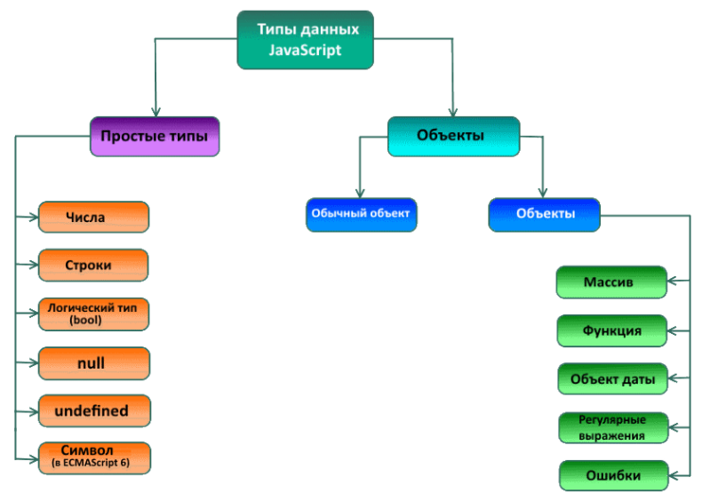

# Мутации, простые и составные типы данных

**СОДЕРЖАНИЕ:**
- [Типы данных в JS](#1)
- [immutable-переменные и простые типы данных](#2)
- [mutable-переменные и составные типы данных](#3)
- [Функции и мутации](#4)

---

<a id="1"></a> 

## Типы данных в JS

В JS типы данных можно разделить на две категории:
- простые типы (примитивные)
- составные типы (объекты)



<a id="2"></a> 

## immutable-переменные и простые типы данных

**immutable** - переменные, которые не могут быть изменены после создания. К ним относятся переменные, которым присвоенно значение простого типа.

Рассмотрим как ведут себя immutable-переменные в JS.

Когда переменной присваивается значение простого типа, то переменная хранит это значение.   
Когда присваиваем переменную простого типа в другую переменную - происходит копирование значения и в результате обе переменные хранят не связанные между собой значения, а изменения в одной из этих переменных никак не сказывается на значении другой переменной.

```js
var x = 5; // Переменной 'x' присваивается значение простого типа
var y = x; // Присваиваем переменную простого типа 'х' в другую переменную 'y'

// Произошло копирование значения и в результате обе переменные хранят не связанные между собой значения 5

x = 25; // Изменяем значение одной из переменных

console.log(x); // 25
console.log(y); // 5
```

<a id="3"></a> 

## mutable-переменные и составные типы данных

**mutable** - переменные, которые могут быть изменены после создания. К ним относятся переменные, которым присвоенно значение составного типа.

Рассмотрим как ведут себя mutable-переменные в JS.

Когда переменной присваивается значение составного типа, то переменная хранит не само значение, а адресс его места в памяти - ссылку на значение.   
Когда присваиваем переменную составного типа в другую переменную - происходит копирование ссылки на значение и в результате обе переменные обращаются к одному и тому же значению. Так как значение одно, то изменения через любую переменную видны в других переменных.

```js
// Переменной 'arr' присваивается значение составного типа,
// но переменная хранит не само значение, а адресс его места в памяти - ссылку на значение
var arr = [1, 2, 3, 4, 5];

// Присваиваем переменную составного типа 'arr' в другую переменную 'newArr'
var newArr = arr;

// Произошло копирование ссылки на значение и в результате обе переменные 
// обращаются к одному и тому же значению.
// Так как значение одно, то изменения через любую переменную видны в других переменных.
// Изменяем значение newArr - удаляем первый элемент
newArr.shift();

console.log(arr); // [2, 3, 4, 5] 
console.log(newArr); // [2, 3, 4, 5] 
```

```js
// Переменной 'obj' присваивается значение составного типа,
// но переменная хранит не само значение, а адресс его места в памяти - ссылку на значение
var obj = { a: 1 };

// Присваиваем переменную составного типа 'obj' в другую переменную 'newObj'
var newObj = obj;

// Произошло копирование ссылки на значение и в результате обе переменные 
// обращаются к одному и тому же значению.
// Так как значение одно, то изменения через любую переменную видны в других переменных.
// Изменяем значение newObj
newObj.a = 25;

console.log(obj); // { a: 25 }
console.log(newObj); // { a: 25 }
```

<a id="4"></a> 

## Функции и мутации 

Простые типы данных передаются в функцию по значению, а составные - по ссылке.

```js
// Переменной 'arr' присваивается значение составного типа,
// но переменная хранит не само значение, а адресс его места в памяти - ссылку на значение.
// Назовем [1, 2, 3] - оригинальным массивом
var arr = [1, 2, 3];

function foo(arr, el) {
	// arr внутри ф-ции - это локальная переменная, в которую была передана ссылка на оригинальный массив.
	// При попытке добавить элемент в локальную переменную - произойдет изменение оригинального массива
	arr.push(el);
	return arr;
}

// Вызываем ф-цию, передавая в неё arr - то-есть ссылку на оригинальный массив
var res = foo(arr, 100)

console.log(arr); // [1, 2, 3, 100]
console.log(res); // [1, 2, 3, 100]
```

В примере выше поменялся не только новый массив 'res', но и старый 'arr'. Так произошло потому, что оригинальный массив 'arr' и локальная переменная 'arr' внутри функции - работают с одинаковой ссылкой на значение [1, 2, 3]. Так как значение одно, то изменения через любую переменную видны в других переменных.